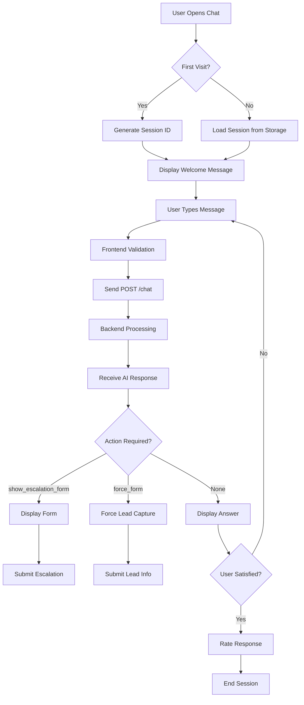
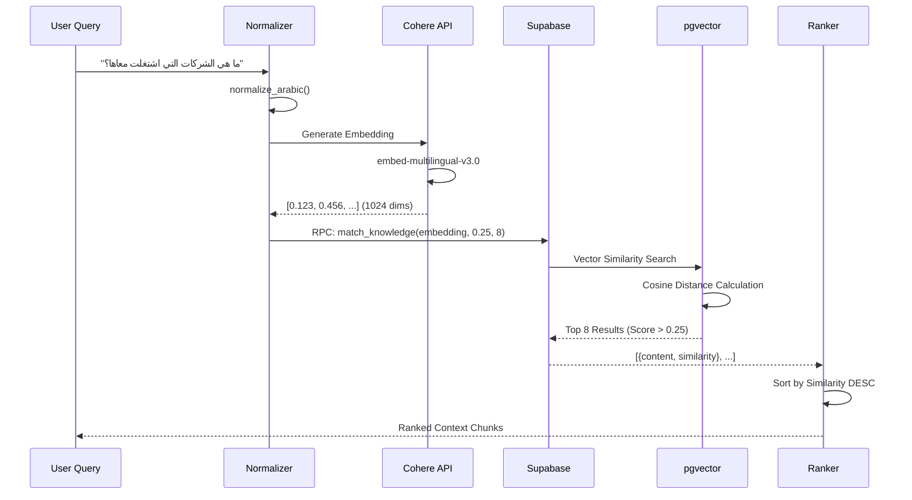
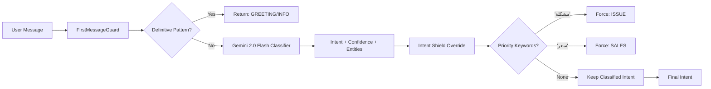
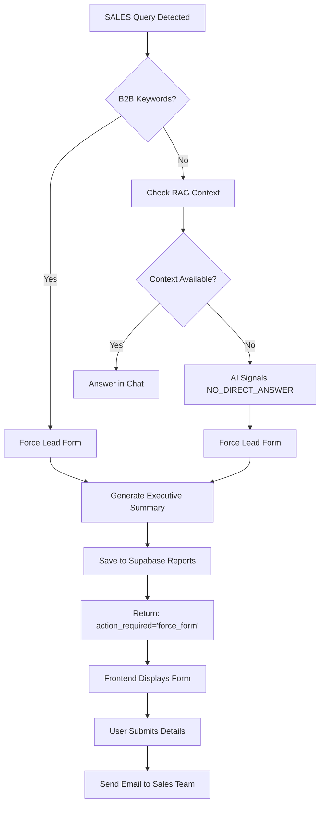
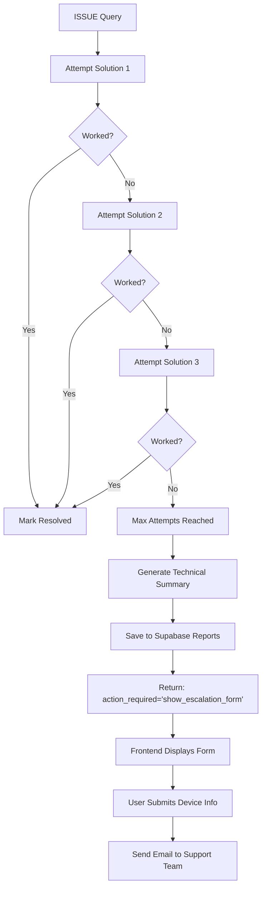
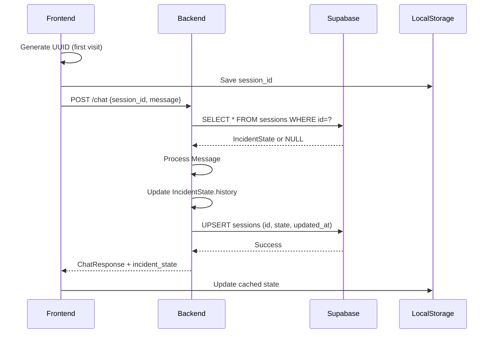

# User & AI Flow Documentation - Zedny Elite

> **Comprehensive Flow Analysis and Architecture Visualization**

---

## Table of Contents

1. [User Journey Flow](#user-journey-flow)
2. [AI Processing Pipeline](#ai-processing-pipeline)
3. [RAG System Flow](#rag-system-flow)
4. [Intent Classification Flow](#intent-classification-flow)
5. [Escalation Flow](#escalation-flow)
6. [Session Management Flow](#session-management-flow)

---

## 1. User Journey Flow

### High-Level User Experience



### Detailed User Interaction States

| State | User Action | System Response | Next State |
|-------|-------------|-----------------|------------|
| **Initial** | Opens chat interface | Generates UUID, displays greeting | **Active** |
| **Active** | Types message | Validates input, shows typing indicator | **Processing** |
| **Processing** | Waits | Calls backend API, streams response | **Displaying** |
| **Displaying** | Reads response | Renders markdown, shows actions | **Active** or **Escalated** |
| **Escalated** | Fills form | Validates fields, submits to backend | **Completed** |
| **Completed** | Views confirmation | Shows success message, offers new chat | **Initial** |

---

## 2. AI Processing Pipeline

### Complete Backend Flow (chat.py)

```mermaid
graph TB
    subgraph "1. Request Reception"
        A[POST /chat] --> B[Parse Request Body]
        B --> C[Extract: message, department, session_id]
    end
    
    subgraph "2. Session Management"
        C --> D{Session Exists?}
        D -->|Yes| E[Load from Supabase]
        D -->|No| F[Create New IncidentState]
    end
    
    subgraph "3. Text Normalization"
        E --> G[normalize_arabic]
        F --> G
        G --> H[Remove diacritics, standardize]
    end
    
    subgraph "4. Intent Classification"
        H --> I{USE_MULTI_AGENT?}
        I -->|True| J[OrchestratorService.process_interaction]
        I -->|False| K[ConversationService.analyze_intent]
        K --> L[Gemini 2.0 Flash: Intent + Entities]
    end
    
    subgraph "5. Intent Shield (Priority Override)"
        L --> M{Contains 'مشكلة' or 'issue'?}
        M -->|Yes| N[Force ISSUE Intent]
        M -->|No| O{Contains 'سعر' or 'price'?}
        O -->|Yes| P[Force SALES Intent]
        O -->|No| Q[Keep Classified Intent]
    end
    
    subgraph "6. RAG Retrieval"
        Q --> R{Intent in INFO/SALES/General?}
        R -->|Yes| S[Detect Factual Keywords]
        S --> T{Has 'شركات', 'companies', etc.?}
        T -->|Yes| U[RAG BOOST: threshold=0.25, limit=8]
        T -->|No| V[Standard: threshold=0.35, limit=4]
        U --> W[Cohere Embedding Generation]
        V --> W
        W --> X[Supabase Vector Search]
        X --> Y{Similarity > threshold?}
        Y -->|Yes| Z[Return Top K Chunks]
        Y -->|No| AA[RAG MISS - Empty Context]
    end
    
    subgraph "7. Trajectory Routing"
        Z --> AB{Intent Type?}
        AA --> AB
        AB -->|SALES| AC[Sales Trajectory]
        AB -->|INFO| AD[Info Trajectory]
        AB -->|ISSUE| AE[Support Trajectory]
        AB -->|GREETING| AF[Greeting Trajectory]
    end
    
    subgraph "8. AI Response Generation"
        AC --> AG[Inject RAG Context + System Prompt]
        AD --> AG
        AE --> AH[Technical Solutions DB + RAG]
        AF --> AI[Brand Loyalty Prompt]
        AG --> AJ[OpenRouter: Gemini/Llama]
        AH --> AJ
        AI --> AJ
        AJ --> AK[Clean Response: Remove Tags]
    end
    
    subgraph "9. Post-Processing"
        AK --> AL{Should Escalate?}
        AL -->|Yes| AM[Generate Professional Summary]
        AL -->|No| AN[Return Answer]
        AM --> AO[Save to Supabase Reports]
        AO --> AP[Return with action_required]
    end
    
    subgraph "10. Session Persistence"
        AN --> AQ[Update IncidentState.history]
        AP --> AQ
        AQ --> AR[Save to Supabase Sessions]
        AR --> AS[Return ChatResponse]
    end
```



### Processing Time Breakdown

| Stage | Average Time | Optimization |
|-------|--------------|--------------|
| Request Parsing | <10ms | ✅ Optimized |
| Session Load | 50-100ms | Supabase query |
| Intent Classification | 300-500ms | Gemini 2.0 Flash |
| RAG Embedding | 100-200ms | Cohere API |
| RAG Vector Search | 50-100ms | pgvector index |
| AI Generation | 800-1500ms | OpenRouter (free tier) |
| Response Cleanup | <10ms | ✅ Optimized |
| Session Save | 50-100ms | Supabase insert |
| **Total** | **1.4-2.5s** | **Target: <3s** |

---

## 3. RAG System Flow

### Embedding & Retrieval Pipeline



### RAG BOOST Logic

```python
# Triggered for factual queries
factual_keywords = ["شركات", "عملاء", "قطاعات", "companies", "clients"]

if any(keyword in normalized_query):
    # BOOST MODE
    threshold = 0.25  # Lower = more recall
    limit = 8         # More chunks = more context
else:
    # STANDARD MODE
    threshold = 0.35
    limit = 4
```

### Knowledge Base Structure

```json
{
  "id": "uuid",
  "title": "Previous Clients - Zedny",
  "content": "اشتغلنا مع جهات كبرى في قطاعات مختلفة...",
  "language": "ar",
  "category": "sales",
  "embedding": [0.123, 0.456, ...],  // 1024 dimensions
  "metadata": {
    "source": "sales_deck_2026.pdf",
    "last_updated": "2026-01-15",
    "confidence": 0.95
  }
}
```

---

## 4. Intent Classification Flow

### Multi-Stage Classification



### Intent Priority Hierarchy

1. **ISSUE** (Highest Priority)
   - Keywords: مشكلة, خطأ, error, problem, broken
   - Action: Technical support trajectory

2. **SALES** (High Priority)
   - Keywords: سعر, باقة, اشتراك, price, package
   - Action: Lead capture + sales escalation

3. **INFO** (Medium Priority)
   - Keywords: إيه, what, who, how, features
   - Action: RAG-powered information retrieval

4. **GREETING** (Low Priority)
   - Keywords: مرحبا, hello, hi, صباح الخير
   - Action: Welcoming response

5. **OFF_TOPIC** (Rejection)
   - Keywords: weather, recipes, unrelated
   - Action: Polite refusal

---

## 5. Escalation Flow

### Sales Escalation



### Technical Escalation



---

## 6. Session Management Flow

### State Persistence



### IncidentState Schema

```typescript
interface IncidentState {
  session_id: string;           // UUID v4
  step: number;                 // Turn count
  category: Intent;             // Current intent
  status: "new" | "active" | "escalated" | "resolved";
  history: string[];            // Full conversation log
  entities: {                   // Extracted info
    course_name?: string;
    payment_status?: string;
    platform_feature?: string;
  };
  summary: string;              // AI-generated summary
  language: "ar" | "en";
  diagnostic_turns: number;     // For ISSUE trajectory
  solutions_tried: string[];    // For ISSUE trajectory
  awaiting_solution_feedback: boolean;
}
```

---

## Performance Optimization Strategies

### Current Optimizations

1. **Caching**
   - Frontend: LocalStorage for session state
   - Backend: In-memory session cache (future)

2. **Database Indexing**
   - `sessions.session_id` (Primary Key)
   - `knowledge_base.embedding` (IVFFlat index)

3. **API Call Reduction**
   - Batch intent + entity extraction in single LLM call
   - Reuse embeddings for similar queries (future)

4. **Model Selection**
   - Fast models for classification (Gemini 2.0 Flash)
   - Heavier models only for complex reasoning

### Future Optimizations

- [ ] Response streaming (SSE)
- [ ] Redis caching for hot sessions
- [ ] Embedding cache (semantic deduplication)
- [ ] CDN for static assets
- [ ] Database connection pooling

---

**Last Updated:** February 3, 2026  
**Maintained By:** Zedny Engineering Team
