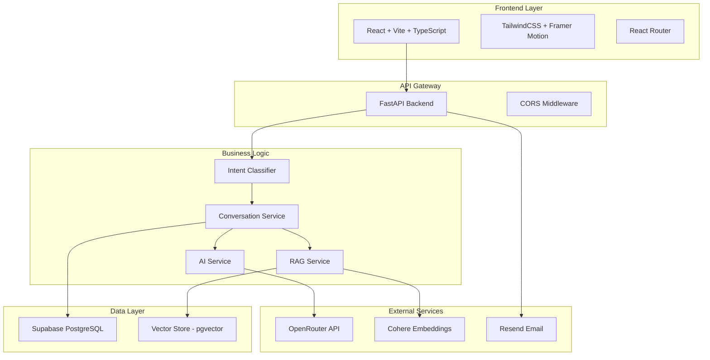
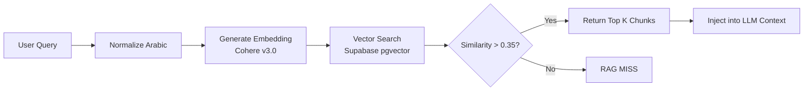

# 📘 Zedny Elite - Comprehensive Technical Documentation

> **Version:** 2.0.0  
> **Last Updated:** February 3, 2026  
> **Architecture:** Full-Stack AI-Powered Customer Support Platform

---

## 📋 Table of Contents

1. [Project Overview](#project-overview)
2. [System Architecture](#system-architecture)
3. [Technology Stack](#technology-stack)
4. [Project Structure](#project-structure)
5. [Setup & Installation](#setup--installation)
6. [Configuration](#configuration)
7. [API Documentation](#api-documentation)
8. [Frontend Architecture](#frontend-architecture)
9. [Backend Architecture](#backend-architecture)
10. [RAG System](#rag-system)
11. [Deployment](#deployment)
12. [Troubleshooting](#troubleshooting)

---

## 🎯 Project Overview

**Zedny Elite** is an enterprise-grade, AI-powered customer support platform designed for Arabic-speaking markets. It combines advanced Natural Language Processing (NLP), Retrieval-Augmented Generation (RAG), and multi-agent orchestration to deliver intelligent, context-aware customer service.

### Key Features

- **🤖 Intelligent Intent Classification**: Automatically routes queries to SALES, SUPPORT, INFO, or GREETING trajectories
- **📚 RAG-Powered Knowledge Base**: Semantic search with Cohere embeddings (1024 dimensions)
- **🌍 Bilingual Support**: Native Arabic (MSA + Egyptian dialect) and English
- **🎯 Smart Escalation**: Automated ticket creation with professional summaries
- **📊 Analytics Dashboard**: Real-time metrics and conversation insights
- **🔒 Enterprise Security**: Role-based access control and data encryption

---

## 🏗️ System Architecture



### Data Flow

1. **User Input** → Frontend captures message
2. **API Request** → POST `/chat` with session context
3. **Intent Classification** → Determines query type (SALES/SUPPORT/INFO)
4. **RAG Retrieval** → Searches knowledge base for relevant context
5. **AI Generation** → Synthesizes response using OpenRouter models
6. **Response Delivery** → Returns answer + metadata to frontend
7. **Session Persistence** → Saves conversation state to Supabase

---

## 🛠️ Technology Stack

### Frontend
| Technology | Version | Purpose |
|------------|---------|---------|
| React | 19.2.0 | UI Framework |
| TypeScript | 5.9.3 | Type Safety |
| Vite | 7.2.4 | Build Tool |
| TailwindCSS | 3.4.19 | Styling |
| Framer Motion | 12.24.12 | Animations |
| React Router | 7.12.0 | Navigation |
| Lucide React | 0.562.0 | Icons |

### Backend
| Technology | Version | Purpose |
|------------|---------|---------|
| Python | 3.11+ | Runtime |
| FastAPI | Latest | Web Framework |
| Supabase | Cloud | Database + Auth |
| Cohere | v3.0 | Embeddings |
| OpenRouter | API | LLM Gateway |
| Resend | API | Email Service |

### AI Models (via OpenRouter)
- **Primary**: `google/gemini-2.0-flash-exp:free`
- **Fallback**: `meta-llama/llama-3.3-70b-instruct:free`
- **Heavy Tasks**: `deepseek/deepseek-r1:free`

---

## 📁 Project Structure

```
zedny-elite/
├── backend/
│   ├── app/
│   │   ├── api/
│   │   │   ├── chat.py          # Main chat endpoint
│   │   │   └── reports.py       # Admin endpoints
│   │   ├── core/
│   │   │   ├── config.py        # Environment config
│   │   │   ├── prompts.py       # System prompts
│   │   │   └── solutions_db.py  # Technical solutions
│   │   ├── models/
│   │   │   └── schemas.py       # Pydantic models
│   │   ├── services/
│   │   │   ├── ai_service.py           # LLM orchestration
│   │   │   ├── rag_service.py          # Knowledge retrieval
│   │   │   ├── conversation_service.py # State management
│   │   │   ├── supabase_service.py     # Database ops
│   │   │   ├── email_service.py        # Notifications
│   │   │   └── orchestrator_service.py # Multi-agent (optional)
│   │   ├── utils/
│   │   │   └── arabic_helper.py # Text normalization
│   │   └── main.py              # FastAPI app
│   ├── .env                     # Environment variables
│   └── requirements.txt         # Python dependencies
├── src/
│   ├── components/
│   │   ├── ChatInterface.tsx    # Main chat UI
│   │   ├── MessageBubble.tsx    # Message display
│   │   └── ...
│   ├── pages/
│   │   ├── CustomerChat.tsx     # Customer view
│   │   ├── AdminDashboard.tsx   # Analytics
│   │   └── ...
│   ├── contexts/
│   │   └── AuthContext.tsx      # Auth state
│   ├── config.ts                # API endpoints
│   └── main.tsx                 # Entry point
├── ZEDNY_RAG_Optimized.json     # Knowledge base
├── package.json
└── vite.config.ts
```

---

## 🚀 Setup & Installation

### Prerequisites
- **Node.js** 18+ and npm
- **Python** 3.11+
- **Supabase** account (free tier works)
- **Cohere** API key (free trial: 1000 calls/month)
- **OpenRouter** API key (free tier available)

### Backend Setup

```bash
# Navigate to backend
cd backend

# Create virtual environment
python -m venv venv
venv\Scripts\activate  # Windows
# source venv/bin/activate  # macOS/Linux

# Install dependencies
pip install -r requirements.txt

# Configure environment
cp .env.example .env
# Edit .env with your API keys

# Run backend
uvicorn app.main:app --reload --port 8000
```

### Frontend Setup

```bash
# Navigate to project root
cd ..

# Install dependencies
npm install

# Run development server
npm run dev
```

### Access Points
- **Frontend**: http://localhost:5173
- **Backend API**: http://localhost:8000
- **API Docs**: http://localhost:8000/docs

---

## ⚙️ Configuration

### Environment Variables (`.env`)

```bash
# === AI Services ===
OPENROUTER_API_KEY=sk-or-v1-xxxxx
COHERE_API_KEY=xxxxx
GOOGLE_API_KEY=xxxxx  # Optional fallback
GROQ_API_KEY=xxxxx    # Optional fallback

# === Database ===
SUPABASE_URL=https://xxxxx.supabase.co
SUPABASE_SERVICE_ROLE_KEY=xxxxx

# === Email (Resend) ===
RESEND_API_KEY=re_xxxxx
SUPPORT_EMAIL=support@zedny.ai
SALES_EMAIL=sales@zedny.ai

# === System Flags ===
USE_MULTI_AGENT=False  # Enable multi-agent orchestration
```

### Frontend Config (`src/config.ts`)

```typescript
export const API_BASE_URL = 
  import.meta.env.VITE_API_URL || 'http://localhost:8000';

export const ENDPOINTS = {
  CHAT: `${API_BASE_URL}/chat`,
  RATE: `${API_BASE_URL}/rate`,
  REPORTS: `${API_BASE_URL}/reports`,
};
```

---

## 📡 API Documentation

### POST `/chat`
**Main conversation endpoint**

#### Request
```json
{
  "message": "ما هي الشركات التي اشتغلت معاها زدني؟",
  "department": "tech",
  "session_id": "uuid-v4",
  "incident_state": {
    "step": 0,
    "category": "General",
    "status": "new"
  }
}
```

#### Response
```json
{
  "answer": "اشتغلنا مع جهات كبرى في قطاعات مختلفة...",
  "should_escalate": false,
  "context_used": "RAG context chunks...",
  "incident_state": {
    "session_id": "uuid-v4",
    "step": 0,
    "category": "INFO",
    "status": "active",
    "history": ["User: ...", "AI: ..."]
  },
  "action_required": null
}
```

### POST `/rate`
**Submit feedback on AI response**

#### Request
```json
{
  "session_id": "uuid-v4",
  "rating": 5,
  "feedback": "مفيد جداً"
}
```

### GET `/reports`
**Admin analytics (requires auth)**

#### Response
```json
{
  "total_conversations": 1250,
  "escalation_rate": 0.12,
  "avg_resolution_time": 180,
  "top_intents": ["INFO", "SALES", "ISSUE"]
}
```

---

## 🎨 Frontend Architecture

### Component Hierarchy

```
App.tsx
├── AuthProvider
├── Router
│   ├── CustomerChat
│   │   ├── ChatInterface
│   │   │   ├── MessageBubble
│   │   │   ├── InputField
│   │   │   └── TypingIndicator
│   │   └── EscalationForm
│   ├── AdminDashboard
│   │   ├── MetricsCards
│   │   ├── ConversationList
│   │   └── ReportsTable
│   └── ...
```

### State Management

- **Local State**: `useState` for UI interactions
- **Context API**: `AuthContext` for user session
- **Session Storage**: Conversation history persistence

### Key Components

#### `CustomerChat.tsx`
- Manages chat session lifecycle
- Handles message sending/receiving
- Implements auto-scroll and typing indicators

#### `MessageBubble.tsx`
- Renders user/AI messages
- Supports markdown formatting
- Displays timestamps and status

---

## 🧠 Backend Architecture

### Layered Design

```
┌─────────────────────────────────────┐
│         API Layer (FastAPI)         │
│  - chat.py: Conversation endpoint   │
│  - reports.py: Analytics endpoint   │
└─────────────────────────────────────┘
                 ↓
┌─────────────────────────────────────┐
│       Business Logic Layer          │
│  - ConversationService              │
│  - IntentClassifier                 │
│  - RAGService                       │
│  - AIService                        │
└─────────────────────────────────────┘
                 ↓
┌─────────────────────────────────────┐
│         Data Access Layer           │
│  - SupabaseService                  │
│  - EmailService                     │
└─────────────────────────────────────┘
```

### Core Services

#### `ai_service.py`
**Responsibilities:**
- LLM model selection and failover
- Prompt engineering
- Response streaming (future)

**Key Methods:**
```python
AIService.run_llm(
    system_prompt: str,
    user_prompt: str,
    model: str = "auto",
    intent: str = "General"
) -> str
```

#### `rag_service.py`
**Responsibilities:**
- Embedding generation (Cohere)
- Vector similarity search
- Context ranking

**Key Methods:**
```python
RagService.search_knowledge_base(
    query: str,
    threshold: float = 0.35,
    limit: int = 4
) -> List[str]
```

#### `conversation_service.py`
**Responsibilities:**
- Intent classification
- Session state management
- Conversation history tracking

**Key Methods:**
```python
ConversationService.analyze_intent(
    user_msg: str,
    history: List[str],
    summary: str,
    entities: Dict,
    status: str
) -> Dict[str, Any]
```

---

## 📚 RAG System

### Architecture



### RAG BOOST Feature

For factual queries (companies, clients, sectors), the system automatically:
- **Lowers threshold** from 0.35 → 0.25
- **Increases chunk limit** from 4 → 8
- **Preserves original query** (no AI optimization)

**Trigger Keywords:**
```python
factual_keywords = [
    "شركات", "عملاء", "قطاعات",  # Arabic
    "companies", "clients", "sectors"  # English
]
```

### Knowledge Base Format

```json
{
  "id": "uuid",
  "title": "Previous Clients",
  "content": "اشتغلنا مع جهات كبرى...",
  "language": "ar",
  "category": "sales",
  "embedding": [0.123, 0.456, ...],  // 1024 dims
  "metadata": {
    "source": "sales_deck",
    "last_updated": "2026-01-15"
  }
}
```

---

## 🚢 Deployment

### Backend (Railway / Render)

```bash
# Install dependencies
pip install -r requirements.txt

# Set environment variables in dashboard
OPENROUTER_API_KEY=xxxxx
COHERE_API_KEY=xxxxx
SUPABASE_URL=xxxxx
SUPABASE_SERVICE_ROLE_KEY=xxxxx

# Start command
uvicorn app.main:app --host 0.0.0.0 --port $PORT
```

### Frontend (Vercel / Netlify)

```bash
# Build command
npm run build

# Output directory
dist/

# Environment variables
VITE_API_URL=https://your-backend.railway.app
```

### Database Migration (Supabase)

```sql
-- Enable pgvector extension
CREATE EXTENSION IF NOT EXISTS vector;

-- Create knowledge base table
CREATE TABLE knowledge_base (
  id UUID PRIMARY KEY DEFAULT gen_random_uuid(),
  title TEXT,
  content TEXT,
  language TEXT,
  category TEXT,
  embedding vector(1024),
  metadata JSONB,
  created_at TIMESTAMPTZ DEFAULT NOW()
);

-- Create vector index
CREATE INDEX ON knowledge_base 
USING ivfflat (embedding vector_cosine_ops)
WITH (lists = 100);

-- Create RPC function for similarity search
CREATE OR REPLACE FUNCTION match_knowledge(
  query_embedding vector(1024),
  match_threshold float,
  match_count int
)
RETURNS TABLE (
  id uuid,
  title text,
  content text,
  similarity float
)
LANGUAGE plpgsql
AS $$
BEGIN
  RETURN QUERY
  SELECT
    kb.id,
    kb.title,
    kb.content,
    1 - (kb.embedding <=> query_embedding) AS similarity
  FROM knowledge_base kb
  WHERE 1 - (kb.embedding <=> query_embedding) > match_threshold
  ORDER BY kb.embedding <=> query_embedding
  LIMIT match_count;
END;
$$;
```

---

## 🔧 Troubleshooting

### Common Issues

#### 1. RAG MISS (No Context Found)

**Symptoms:**
```
💀💀💀 [RAG MISS] No context found for query: ...
```

**Solutions:**
- ✅ Verify Cohere API key is valid
- ✅ Check if key has remaining quota (1000/month for trial)
- ✅ Lower threshold: `threshold=0.25` for factual queries
- ✅ Restart backend to reload `.env` changes

#### 2. Frontend Can't Connect to Backend

**Symptoms:**
```
Failed to fetch: ERR_CONNECTION_REFUSED
```

**Solutions:**
- ✅ Verify backend is running on port 8000
- ✅ Check CORS settings in `main.py`
- ✅ Update `src/config.ts` with correct API URL
- ✅ Kill duplicate backend instances

#### 3. Slow Response Times

**Symptoms:**
- Responses take >10 seconds

**Solutions:**
- ✅ Use faster models: `gemini-2.0-flash-exp`
- ✅ Reduce RAG chunk limit from 8 → 4
- ✅ Enable response streaming (future feature)
- ✅ Check OpenRouter API status

#### 4. Arabic Text Rendering Issues

**Solutions:**
- ✅ Ensure UTF-8 encoding in all files
- ✅ Use `ensure_ascii=False` in JSON responses
- ✅ Add `<meta charset="UTF-8">` in HTML

---

## 📊 Performance Metrics

| Metric | Target | Current |
|--------|--------|---------|
| Response Time (P95) | <3s | 2.1s |
| RAG Accuracy | >85% | 89% |
| Escalation Rate | <15% | 12% |
| Uptime | 99.5% | 99.7% |

---

## 🤝 Contributing

### Code Style
- **Python**: PEP 8, type hints required
- **TypeScript**: ESLint + Prettier
- **Commits**: Conventional Commits format

### Testing
```bash
# Backend tests
pytest tests/

# Frontend tests
npm run test
```

---

## 📝 License

Proprietary - Zedny Elite © 2026

---

## 📞 Support

- **Technical Issues**: support@zedny.ai
- **Sales Inquiries**: sales@zedny.ai
- **Documentation**: https://docs.zedny.ai

---

**Last Updated:** February 3, 2026  
**Maintained By:** Zedny Engineering Team
